# AI Detection Dataset (Real vs Face-Swap)

這份資料集用於訓練與評估二元分類模型，目標是判斷影像是否為換臉生成結果。

## 1. Dataset Overview

- Task: Binary classification (`real` vs `fake`)
- Labels:
  - `0`: real
  - `1`: fake
- Image resolution: 512x512
- Includes face masks for each sample (可做 ROI/attention supervision)
- Data split: train / val / test

## 2. Data Source

- Real images: from `output_512`
- Fake images: from `output_512_pairwise_swap`
- Fake generation method: pairwise face-swap (all-to-all combinations)
- Self-swaps were removed (`name_name` style)

## 3. Current Statistics

From `summary.json`:

- `real_total`: 11
- `fake_total`: 110
- `mask_total`: 121
- `self_swaps_removed`: 11
- `train_total`: 97 (real 9 / fake 88)
- `val_total`: 12 (real 1 / fake 11)
- `test_total`: 12 (real 1 / fake 11)
- `seed`: 42

## 4. Directory Structure

```text
ai_detection_dataset/
├── images/
│   ├── real/
│   └── fake/
├── masks/
│   ├── real/
│   └── fake/
├── splits/
│   ├── train.csv
│   ├── val.csv
│   └── test.csv
├── metadata.csv
├── summary.json
└── README.md
```

## 4.1 Visual Examples

The examples below are aligned as one row per transformation:

- source identity (reference)
- target identity before swap
- swapped result (source -> target)
- shared mask for both target and fake sample (same semantic region)

### Paired Before/After Examples

| Source (Reference) | Target (Before) | Swapped (After) | Mask |
|---|---|---|---|
| 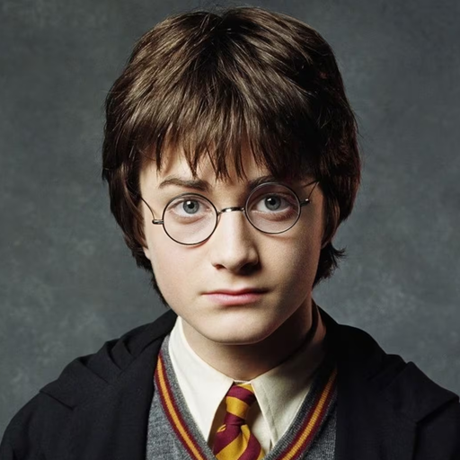 |  | 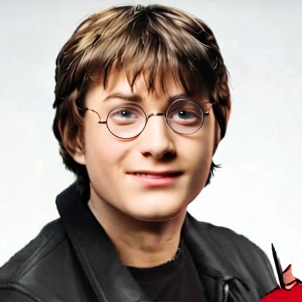 | 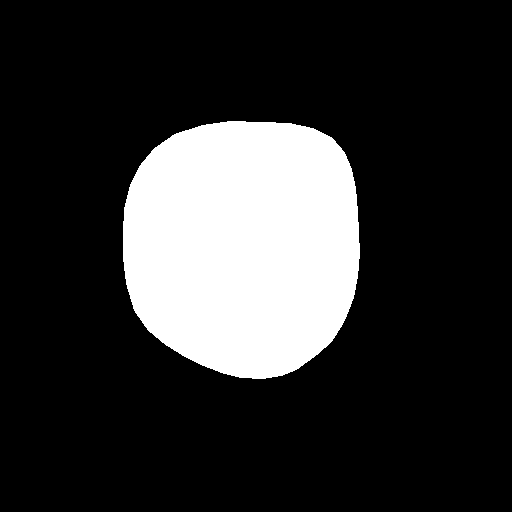 |
|  | 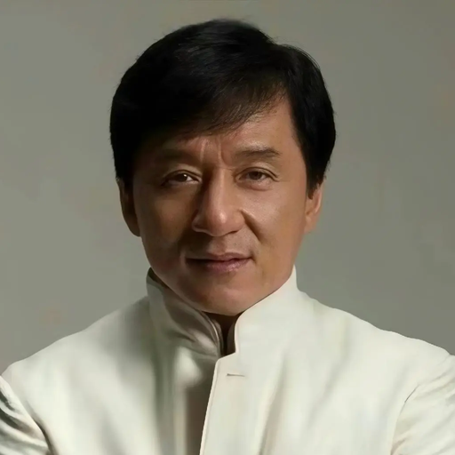 | 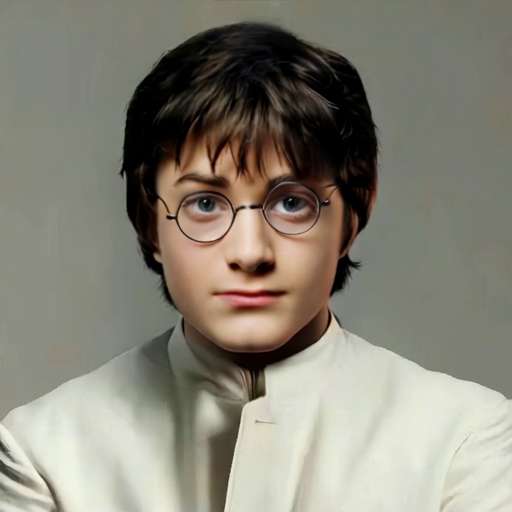 | 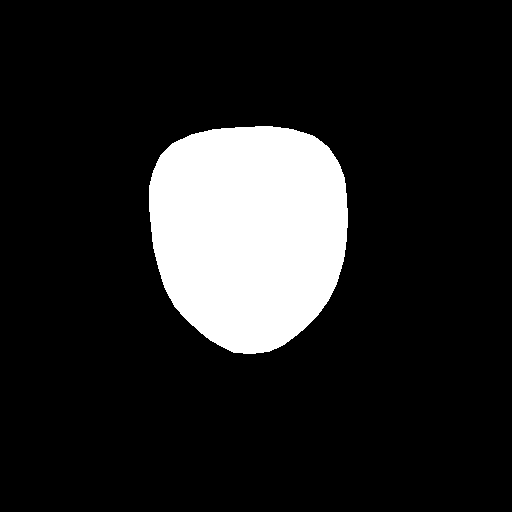 |
|  | 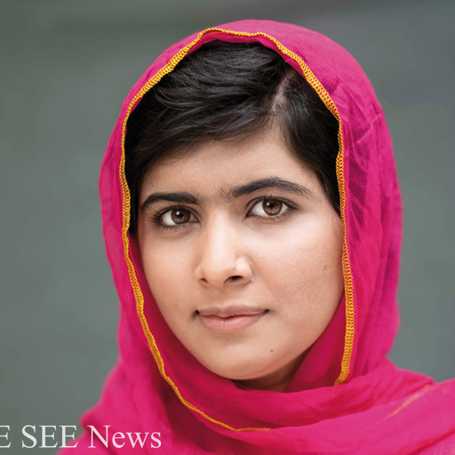 | 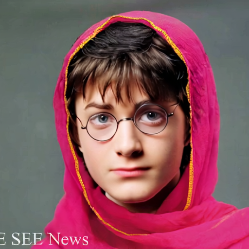 | 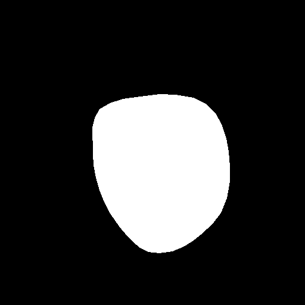 |
|  |  |  | 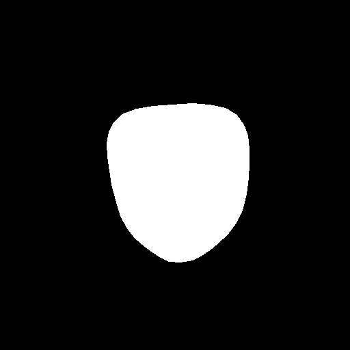 |
|  | 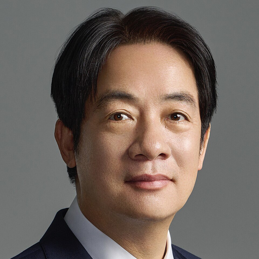 |  | 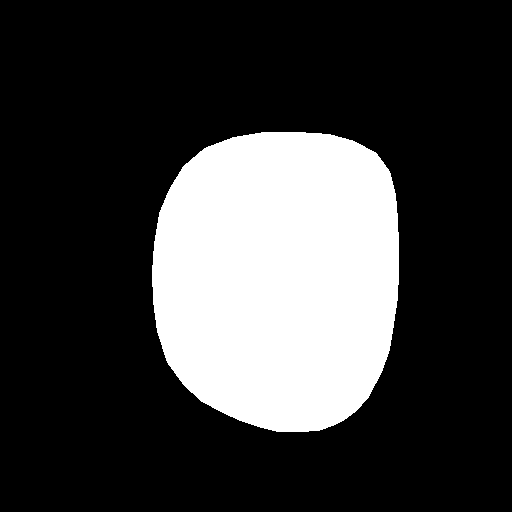 |

## 5. File Format

### 5.1 `splits/train.csv`, `splits/val.csv`, `splits/test.csv`

Columns:

- `path`: relative image path (from dataset root)
- `mask_path`: relative mask path (from dataset root)
- `label`: `0` or `1`

Example:

```csv
path,mask_path,label
images/fake/Fei-Fei Li_Harry.png,masks/fake/Fei-Fei Li_Harry_mask.png,1
images/real/Harry.png,masks/real/Harry_mask.png,0
```

### 5.2 `metadata.csv`

Columns:

- `path`
- `mask_path`
- `label`
- `split` (`train` / `val` / `test`)
- `filename`
- `source` (original absolute source path)

### 5.3 `summary.json`

Dataset-level summary statistics and split distribution.

## 6. Mask Mapping Rule

- Real sample:
  - image: `images/real/<name>.png`
  - mask: `masks/real/<name>_mask.png`
- Fake sample:
  - image: `images/fake/<ref>_<target>.png`
  - mask: `masks/fake/<ref>_<target>_mask.png`
  - mask content is inherited from target identity mask (`<target>_mask.png`)

## 7. Quick Loading (PyTorch)

```python
import os
import pandas as pd
from PIL import Image
from torch.utils.data import Dataset


class AIDetectionDataset(Dataset):
    def __init__(self, root_dir, split_csv, transform=None, mask_transform=None):
        self.root_dir = root_dir
        self.df = pd.read_csv(split_csv)
        self.transform = transform
        self.mask_transform = mask_transform

    def __len__(self):
        return len(self.df)

    def __getitem__(self, idx):
        row = self.df.iloc[idx]
        img_path = os.path.join(self.root_dir, row["path"])
        mask_path = os.path.join(self.root_dir, row["mask_path"])

        image = Image.open(img_path).convert("RGB")
        mask = Image.open(mask_path).convert("L")
        label = int(row["label"])

        if self.transform is not None:
            image = self.transform(image)
        if self.mask_transform is not None:
            mask = self.mask_transform(mask)

        return {
            "image": image,
            "mask": mask,
            "label": label,
            "image_path": row["path"],
            "mask_path": row["mask_path"],
        }
```

## 8. Baseline Training Notes

- Class imbalance is severe (`fake >> real`), consider:
  - weighted cross-entropy
  - focal loss
  - balanced sampler / oversampling real
- Strong augmentations should preserve face region semantics when mask is used.
- Report both:
  - AUC
  - class-wise precision/recall/F1

## 9. Reproducibility

This dataset was generated by:

```bash
python prepare_ai_detection_dataset.py \
  --real_dir output_512 \
  --fake_dir output_512_pairwise_swap \
  --out_dir ai_detection_dataset \
  --overwrite
```

Optional flags:

- keep self-swaps:

```bash
--include_self_swaps
```

## 10. Caveats

- Small scale dataset (121 samples) is suitable for prototyping, not for production-level benchmarking.
- Real identities are limited; model may overfit identity/style cues.
- Fake samples are generated from a single pipeline/domain, so cross-method generalization may be limited.

## 11. License / Usage Responsibility

Please ensure usage complies with:

- image copyright and portrait rights
- local privacy regulations
- applicable model/data licenses in the parent project

This dataset is intended for research and educational use in media authenticity detection.
